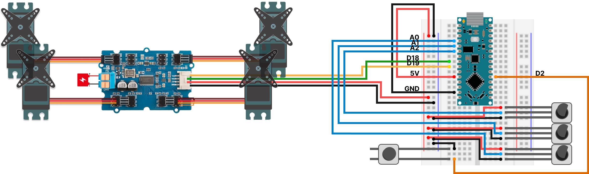
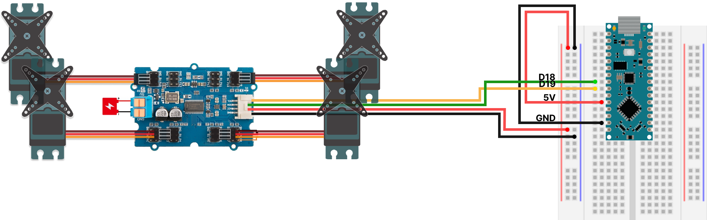

# IDE1 - Cyber-Physical Systems
Repository for the Group Project and worksheet exercises.

## Worksheet 1

### Brief

> **Format**: Live in-person demonstration of the robot arm built and controlled by an Arduino.
> 
> **Marking criterion**: 
> 
> - Mechanism functioning:
>   - Each of the four servos are shown to move and provide a unique functionality for the arm to the best of the ability of the available parts.
>   - The arm does not need to be modified in any way. If it is modified (perhaps as part of the development towards the final project), then each of the four servos are still shown to have a distinct mechanical function.
> 
> - Digital control:
>   - Each of the motors are controlled via a single sketch running on the Arduino, i.e. no additional uploading of a different sketch is needed to control a different motor.
>   - If the motors are not functioning, then evidence of debugging and documentation of what issues are being encountered is presented.
>   - The motors control can be fully scripted and does not need to be interactive.
> 
> - Electronics design:
>   - The circuit is correctly powered. An external mains power supply is used to provide power for the servos. The servos are not being powered via a laptop.
>   - The Arduino can be powered via a laptop or another power source

### Wiring diagram

## Worksheet 2

### Brief

> **Format**: Live in-person demonstration of the robot arm controlled by interactions on a laptop.
> 
> **Marking criterion**: 
> 
> - Messaging functioning:
>   - Using whatever software messaging tools the group would like, control something happening on an Arduino (blink a light, more a motor, etc) from a command on the laptop.
>   - The software on the laptop can be Processing or another platform.
>   - Whilst not required, it is recommended that this uses the tools you’ll use in your project.

### Wiring diagram

